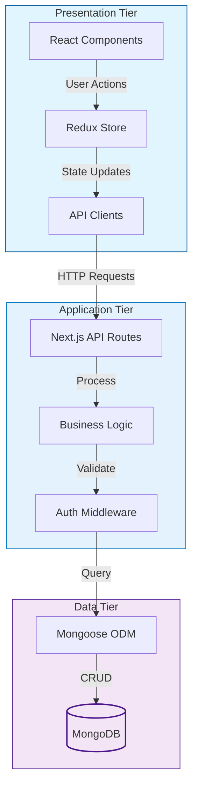

# 🛍️ EasyShop - Modern E-commerce Platform

[](https://nextjs.org/)
[](https://www.typescriptlang.org/)
[](https://www.mongodb.com/)
[](https://redux.js.org/)
[](LICENSE)

EasyShop is a modern, full-stack e-commerce platform built with Next.js 14, TypeScript, and MongoDB. It features a beautiful UI with Tailwind CSS, secure authentication, real-time cart updates, and a seamless shopping experience.

## ✨ Features

- 🎨 Modern and responsive UI with dark mode support
- 🔐 Secure JWT-based authentication
- 🛒 Real-time cart management with Redux
- 📱 Mobile-first design approach
- 🔍 Advanced product search and filtering
- 💳 Secure checkout process
- 📦 Multiple product categories
- 👤 User profiles and order history
- 🌙 Dark/Light theme support

## 🏗️ Architecture

EasyShop follows a three-tier architecture pattern:

### 1. Presentation Tier (Frontend)
- Next.js React Components
- Redux for State Management
- Tailwind CSS for Styling
- Client-side Routing
- Responsive UI Components

### 2. Application Tier (Backend)
- Next.js API Routes
- Business Logic
- Authentication & Authorization
- Request Validation
- Error Handling
- Data Processing

### 3. Data Tier (Database)
- MongoDB Database
- Mongoose ODM
- Data Models
- CRUD Operations
- Data Validation



### Key Features of the Architecture
- **Separation of Concerns**: Each tier has its specific responsibilities
- **Scalability**: Independent scaling of each tier
- **Maintainability**: Modular code organization
- **Security**: API routes handle authentication and data validation
- **Performance**: Server-side rendering and static generation
- **Real-time Updates**: Redux for state management

### Data Flow
1. User interacts with React components
2. Actions are dispatched to Redux store
3. API clients make requests to Next.js API routes
4. API routes process requests through middleware
5. Business logic handles data operations
6. Mongoose ODM interacts with MongoDB
7. Response flows back through the tiers

## 🚀 Getting Started

### Prerequisites

> [!NOTE]
> Make sure you have the following installed:
> - Node.js (v18 or higher)
> - npm (v9 or higher)
> - MongoDB (v7 or higher)

### Installation Steps

1. Clone the repository
```bash
git clone https://github.com/iemafzalhassan/EasyShop.git
cd EasyShop
```

2. Install dependencies
```bash
npm install
```

3. Set up environment variables
```bash
cp .env.example .env.local
```

> [!IMPORTANT]
> Create a `.env.local` file in the root directory with the following configuration:
> ```env
> # Database Configuration
> MONGODB_URI=mongodb://localhost:27017/easyshop
> 
> # Next.js Configuration
> NEXTAUTH_URL=http://localhost:3000
> NEXT_PUBLIC_API_URL=http://localhost:3000/api
> 
> # Authentication
> JWT_SECRET=your-secure-jwt-secret-key
> ```
> 
> **Note**: Replace `your-secure-jwt-secret-key` with a secure secret key for JWT token generation. 
> You can generate one using [JWT Builder Tool](http://jwtbuilder.jamiekurtz.com/) or any other secure JWT generator.

### Running the Application

Follow these commands in sequence:

1. First, run the database migrations to set up your database with initial data:
```bash
npm run migrate
```

2. For development:
```bash
# Start the development server with hot reload
npm run dev
```

3. For production:
```bash
# Build the application
npm run build

# Start the production server
npm start
```

> [!NOTE]
> - Development server runs on: http://localhost:3000
> - The migrate command only needs to be run once when setting up the project
> - Always run `npm run build` before `npm start` in production

## 🧪 Testing

> [!NOTE]
> Coming soon: Unit tests and E2E tests with Jest and Cypress

## 🔧 Troubleshooting

### Build Errors

1. **Dynamic Server Usage Warnings**
```bash
Error: Dynamic server usage: Page couldn't be rendered statically
```
**Solution**: This is expected behavior for dynamic routes and API endpoints. These warnings appear during build but won't affect the application's functionality.

2. **MongoDB Connection Issues**
```bash
Error: MongoDB connection failed
```
**Solution**: 
- Ensure MongoDB is running locally
- Check if your MongoDB connection string is correct in `.env.local`
- Try connecting to MongoDB using MongoDB Compass with the same connection string

### Development Tips
- Clear `.next` folder if you encounter strange build issues: `rm -rf .next`
- Run `npm install` after pulling new changes
- Make sure all environment variables are properly set
- Use Node.js version 18 or higher

## 📦 Project Structure

```
easyshop/
├── src/
│   ├── app/              # Next.js App Router pages
│   ├── components/       # Reusable React components
│   ├── lib/             # Utilities and configurations
│   │   ├── auth/        # Authentication logic
│   │   ├── db/          # Database configuration
│   │   └── features/    # Redux slices
│   ├── types/           # TypeScript type definitions
│   └── styles/          # Global styles and Tailwind config
├── public/              # Static assets
└── scripts/            # Database migration scripts
```

## 🤝 Contributing

We welcome contributions! Please follow these steps:

1. Fork the repository
2. Create a new branch: `git checkout -b feature/amazing-feature`
3. Make your changes
4. Run tests: `npm test` (coming soon)
5. Commit your changes: `git commit -m 'Add amazing feature'`
6. Push to the branch: `git push origin feature/amazing-feature`
7. Open a Pull Request

> [!TIP]
> Check our [Contributing Guidelines](CONTRIBUTING.md) for more details

## 📝 License

This project is licensed under the MIT License - see the [LICENSE](LICENSE) file for details.

## 🙏 Acknowledgments

- [Next.js](https://nextjs.org/)
- [Tailwind CSS](https://tailwindcss.com/)
- [MongoDB](https://www.mongodb.com/)
- [Redux Toolkit](https://redux-toolkit.js.org/)
- [Radix UI](https://www.radix-ui.com/)

## 📫 Contact

For questions or feedback, please open an issue or contact the maintainers:

- Maintainer - [@Md. Afzal hassan Ehsani](https://github.com/iemafzalhassan)
- Project Link: [https://github.com/iemafzalhassan/easyshop](https://github.com/iemafzalhassan/easyshop)

---

<div align="center">
  <p>
    Made with ❤️ by <a href="https://iemafzalhassan.tech" target="_blank"><b>Md. Afzal Hassan Ehsani</b></a>
  </p>
</div>
